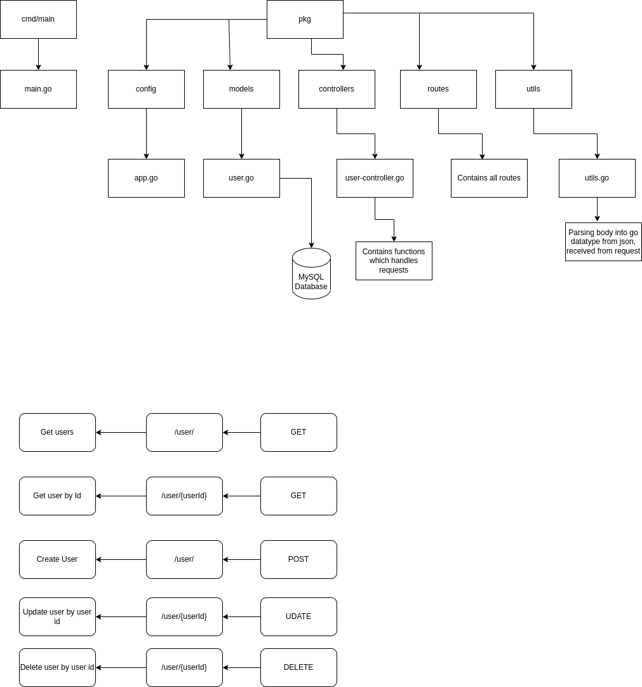

## API Gateway

#### Libraries Used

1. MySQL Database

2. GORM - Database Relational Mapper

3. JSON Marshal and Unmarshal

3. Gorilla Mux for Routing

#### Routes
1. To add user

Method: POST => /user/

2. To get list of all users from Database

Method: GET => /user/

3. To update user details

Method: UPDATE => /user/{userId} 

4. To get user by id

Method: GET => /user/{userId}

4. To delete user from database
 
Method: DELETE => /user/{userId}

